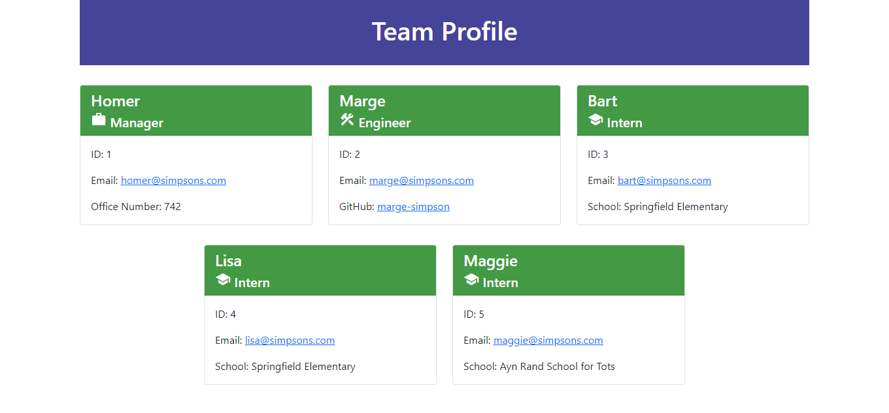

# Team Profile Generator


## Description
This project accepts user input to prompts to generate a team profile webpage. It was created using Node.js, and uses the Inquerer NPM package to ask the questions, and the Jest NPM package for testing.

## Table of Contents
  * [Installation](#installation)

  * [Usage](#usage)

  * [Tests](#tests)

  * [Questions](#questions)

## Installation
To install necessary dependencies run the following command:
```bash
npm i
```

## Usage
To start the Team Profile Generator run the following command:
```bash
node index.js
```

The app first asks for the name, employee ID number, email address, and office number of the team mananger. It then gives you the option of adding an engineer or an intern. If you select engineer it requests their name, employee ID number, email address, and GitHub username. If you select intern it requests their name, employee ID number, email address, and school name. After each new team member, you're given the option to add another, or quit. Once the entire team has been entered, a new HTML file is created that shows the team profile laid out on cards.

A usage demonstration video is available [here](https://drive.google.com/file/d/19AdyJBX1DtUn4V2vpt47DZ1fU1eWKV8H/view).

## Tests
```bash
npm test
```

## Questions
If you have questions about this repo, open an issue or contact me directly at todd@theharveysplace.com. You can find more of my work at [tharveyster](https://github.com/tharveyster).

## License
MIT

## Screenshot of a Page Generated With This App
